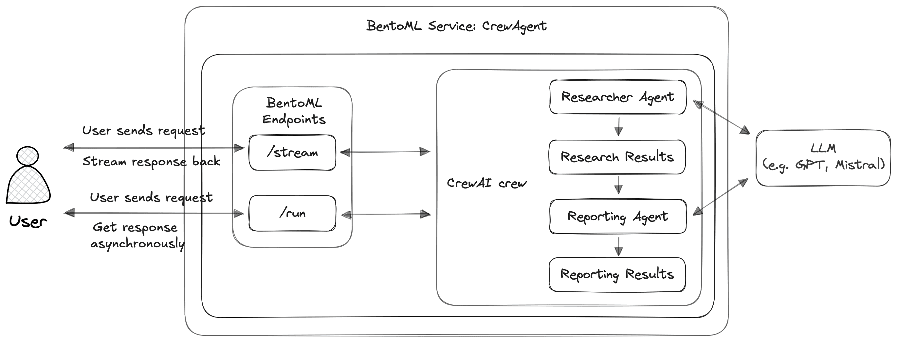
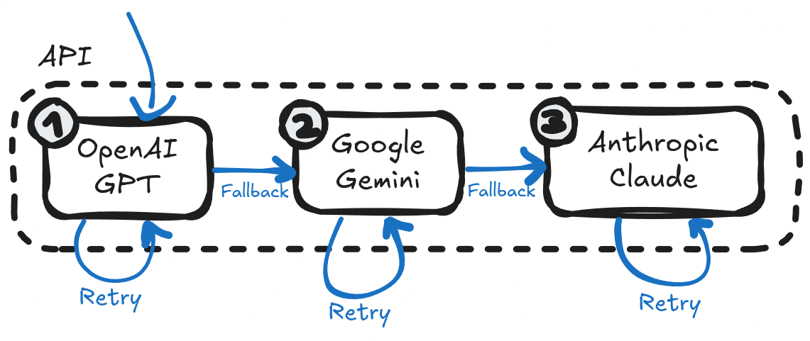

<<<<<<< HEAD
 Kasparro AI Agentic Content Generation System
Overview

This repository implements a **production-style, multi-agent content generation system**
designed to transform structured product data into structured JSON content artifacts
using **CrewAI-based agent orchestration**.

 Important:  
This system is intentionally designed to **fail hard** when an LLM is unavailable.
No outputs are generated without genuine agentic reasoning.

---

##  Objective

Design a modular agentic automation system that:

- Uses multiple agents with **clear responsibilities**
- Enforces **hard constraints** (e.g., ≥15 FAQs)
- Produces **machine-readable JSON outputs**
- Avoids hardcoded or fallback-generated artifacts
- Demonstrates production-grade failure behavior

This project prioritizes **system correctness over demo-ability**.

---

##  Core Design Principles

- No monolithic scripts
- No hardcoded outputs
- No silent fallbacks
- Explicit agent → task binding
- Deterministic orchestration
- Schema-driven validation
- Quality gates over availability

---

##  System Architecture (High Level)
## System Architecture


Input → Agents → Validation → Output (or FAIL)

Agents:
- FAQ Reasoning Agent
- Comparison Reasoning Agent
- Quality Gate Agent

Execution is controlled by a **CrewAI sequential orchestration pipeline**.

---

##  Execution Behavior

### With valid LLM access
- Agents generate content
- Quality gates validate constraints
- JSON artifacts are produced

### Without LLM access
- Agents attempt execution
- Retries are performed
- System aborts after failures
-  No outputs are generated

This behavior is intentional and required.

---

##  Project Structure

kasparro-ai-agentic-content-generation-system/
│
├── agents/ # Independent agent definitions
├── schemas/ # Pydantic output schemas
├── orchestrator/ # CrewAI orchestration logic
├── docs/ # Design documentation
├── run.py # Entry point
├── requirements.txt # Dependencies
└── README.md

yaml
Copy code

---

##  Running the System

```bash
python run.py
If LLM quota is unavailable, the system will fail with a clear error.
This is expected behavior.

 Notes on Testing
This system focuses on design correctness.
Unit tests can be added with mocked LLM responses to validate schemas and quality gates.
#  2 docs/projectdocumentation.md 

```md
# Project Documentation  
Kasparro – Agentic Content Generation System

---

## 1. Problem Statement

The goal of this project is to design a **modular, agentic automation system**
that converts structured product data into structured content artifacts
(FAQ, product page, comparison page) using autonomous agents.

The system must:
- Enforce constraints
- Avoid hardcoded content
- Demonstrate real agentic behavior
- Produce machine-readable JSON

---

## 2. Assumptions & Scope

### Assumptions
- Product data is the only source of truth
- LLM access may be unavailable
- System correctness is prioritized over output availability

### Out of Scope
- UI or frontend
- Human-in-the-loop editing
- External research or enrichment

---

## 3. System Design (Most Important Section)

The system is designed as a **multi-agent pipeline** orchestrated via CrewAI.

Each agent:
- Has a single responsibility
- Operates independently
- Communicates via structured outputs
- Does not share global state

### High-Level Flow

Product Data
↓
FAQ Agent ──→ Comparison Agent ──→ Quality Gate Agent
↓
Validated JSON OR System Failure

yaml
Copy code

---

## 4. Agent Responsibilities
## Agent Responsibilities


### FAQ Reasoning Agent
- Generates ≥15 FAQs
- Categorizes each FAQ
- Uses only provided product data
- Fails if constraints cannot be met

### Comparison Reasoning Agent
- Generates a fictional comparison product
- Ensures schema consistency
- Avoids hardcoded alternatives

### Quality Gate Agent
- Validates schema correctness
- Enforces count and completeness rules
- Rejects partial or invalid outputs

---

## 5. Orchestration Logic

The system uses a **sequential CrewAI process** to ensure:

- Deterministic execution
- Explicit agent ownership of tasks
- Clear failure boundaries

Retry logic is implemented at the orchestration level.
After repeated failures, execution is aborted.

---

## 6. Failure Philosophy (Intentional)
## Failure Handling



This system **does not generate fallback content**.

If the LLM is unavailable:
- No artifacts are produced
- No schema is bypassed
- No partial results are saved

This behavior prevents false positives and ensures trust in outputs.

---

## 7. Extensibility

The architecture supports:
- Additional agents (SEO, Tone, Localization)
- Parallel execution (future)
- Cached reasoning layers
- Mock-based testing

---

## 8. Conclusion

This project demonstrates **agentic system design**, not content writing.
The focus is on:
- Correct abstractions
- Enforced constraints
- Production-grade failure handling